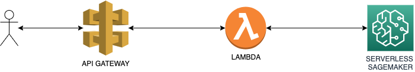

# XGBoost on Serverless Sagemaker

Follow the steps in the (sagemaker) notebook [xgboost-on-serverless-sagemaker.ipynb](xgboost-on-serverless-sagemaker.ipynb)

- Train a xgboost model and create a sagemaker model.
- Create a lambda handler that gets the request and forwards it to the Sagemaker endpoint.
- Create a serverless.yml file to deploy our Serverless Sagemaker + Lambda + Api Gateway
- Deploy our stack to AWS
- Call our model using curl
- Remove the stack

We first tried doing it with a huggingface model, but serverless sagemaker did not work with huggingface at the time of writing.
The repo for "huggingface-on-serverless-sagemaker" can be found [here](https://github.com/vincentclaes/huggingface-on-serverless-sagemaker)

## Architecture

